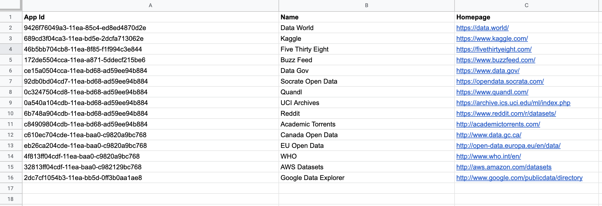
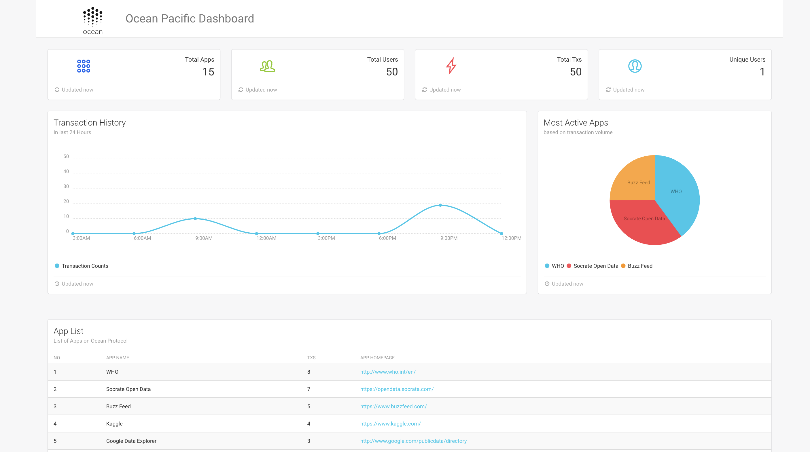
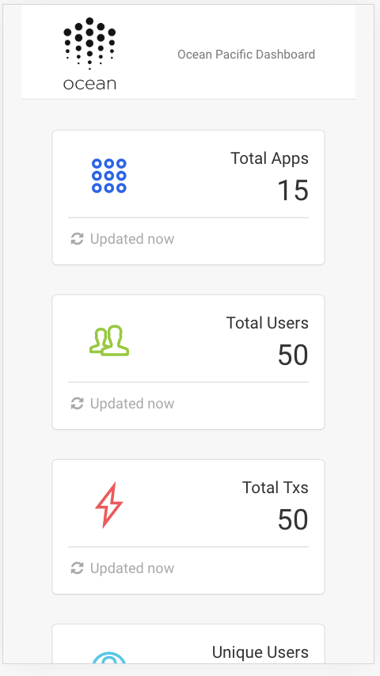

# Ocean Pacific Dashboard

Dashboard to display various off-chain stats of Apps developed on Ocean Protocol. 

## What are the metrics tracked?

- Total Registered Apps
- Total Users on those apps
- Total Transactions originated from those apps
- Total Unique users for those apps
- Most active/used apps
- Transaction history for past 24 hours
- All apps and their details

### Methodology used to obtain stats

- Since Ocean Protocol is a protocol and doesn't have a well-defined infrastructure to track these off-chain stats out of the box, I found a following work around. 

- I am using a google sheet as a database 'as required' in the bounty, assuming that all the registered apps lives in that spreadsheet. Sample gsheet used is shown below

I used google api to read from this sheet. During page loads. Another source of data is Ocean's pacific network. Since, this app is tracking off-chain stats (for on-chain stats Ocean Protocol has [Submarine Dashboard](https://submarine.oceanprotocol.com/)) 

To achieve this I used metadata object of DDO and added two additional fields -
1. Platform Id  (which is my defined dashboard id)
1. App Id (which is id of each app. Sample can be seen in gsheet screenshot above)

Then I used Aquarius api to query all txs and then filter each stat out of those transactions for each app and generated stats.

Final Web view looks like this - 

This app is also responsive and works well for small screens

### Installation and Usage

- This app consists of 2 parts 
    * Client
    * Server

- All details on running both these components can be found in their respective folders